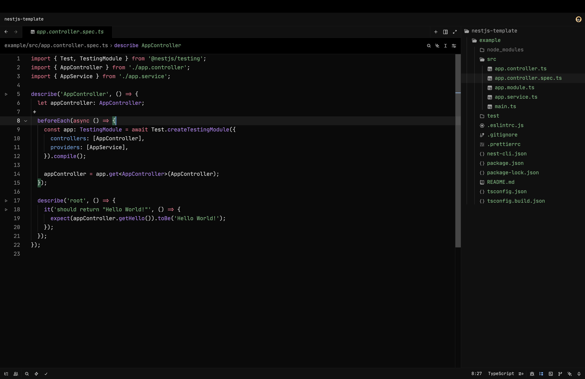

# Vercel Dimmed Theme

# AI SDK

A minimal, dark theme for [Zed](https://zed.dev) inspired by the setup shown in [Nico Albanese's video](https://www.youtube.com/watch?v=iF8n-z9Azqw&t=117s).

## Why this theme?

After watching Nico's video, I really liked the look of his Zed setup. I noticed a lot of people in the comments were asking which theme he was using. There is already a Vercel theme on the Zed marketplace, but it doesn't exactly match what's shown in the video.

So I decided to recreate it as closely as possible and publish it, so anyone can get the same look without having to manually tweak their settings.

The **True Syntax** variant uses syntax colors based on the syntax highlighting displayed on [vercel.com](https://vercel.com).

## Preview

## License

[MIT](./LICENSE)
